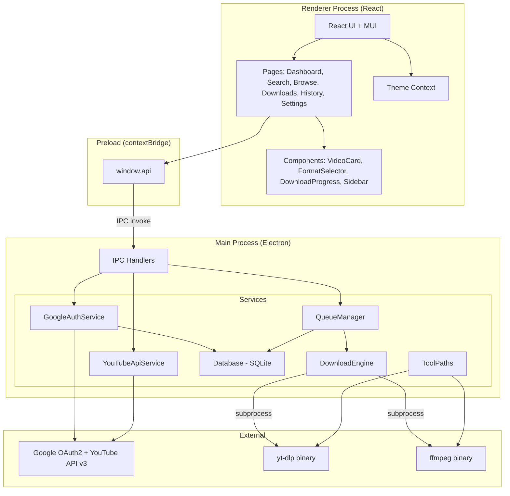
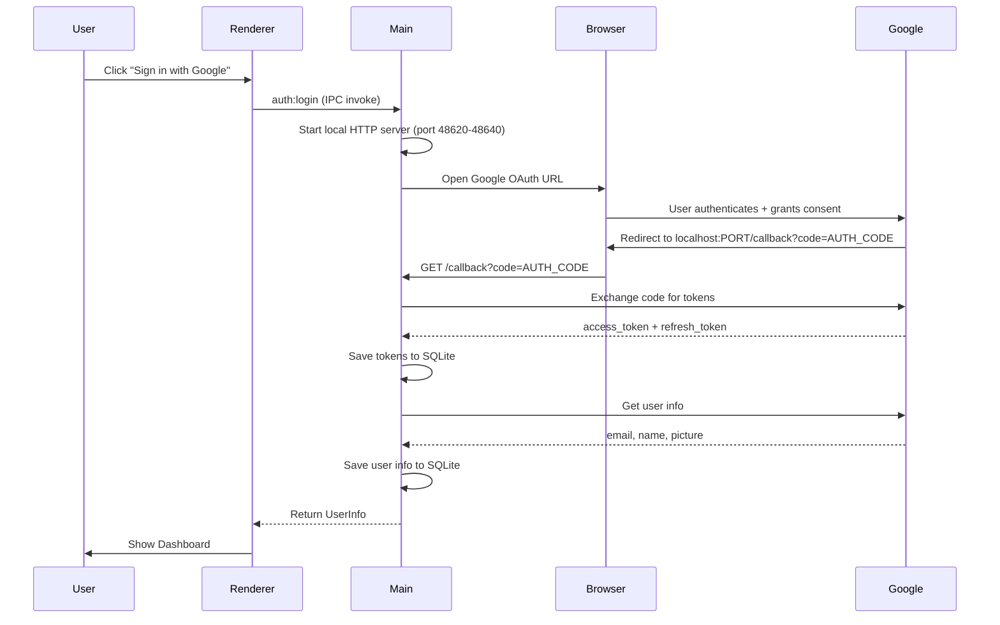
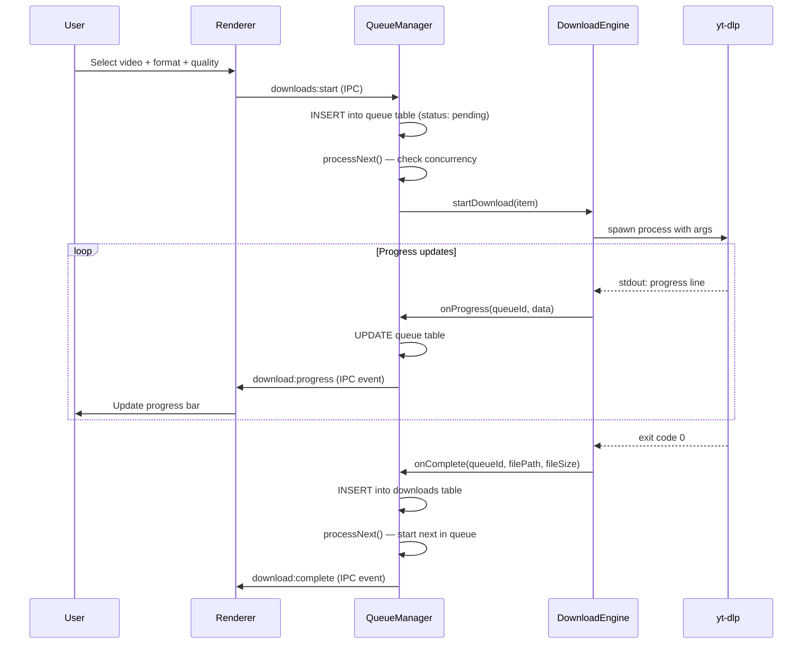
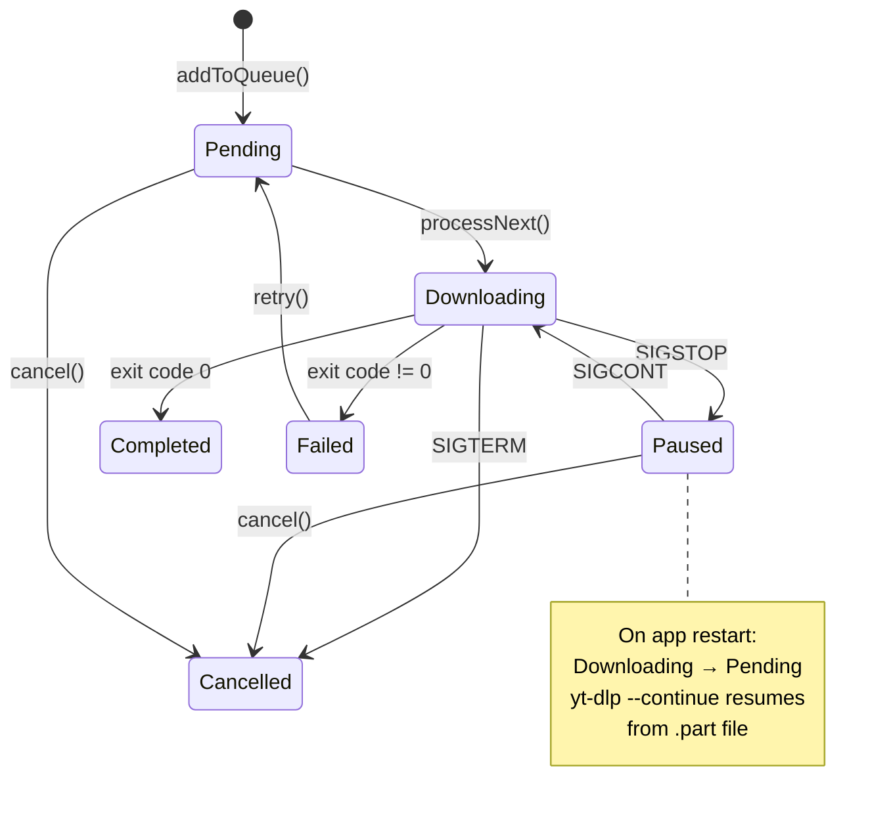
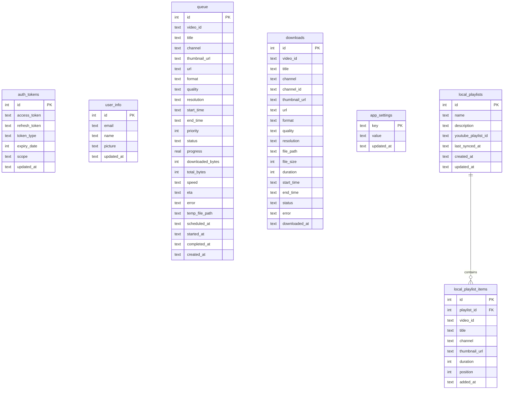

# ytd — Architecture Document

## Overview

ytd is a full-featured YouTube Downloader desktop application built with Electron, React, and TypeScript. It follows the same architecture as gsync (Google Drive Sync app) with a clear separation between main process services, IPC communication, and the React renderer.

## System Architecture



## OAuth Authentication Flow



## Download Flow



## Pause/Resume Flow



## Database Schema



## Project Structure

```
ytd/
├── desktop/                    # Electron main process (TypeScript → CommonJS)
│   ├── index.ts                # App entry, window, menu
│   ├── preload.ts              # contextBridge (renderer ↔ main)
│   ├── ipc-handlers.ts         # All IPC channel registration
│   └── services/
│       ├── google-auth.ts      # OAuth2 via system browser
│       ├── embedded-config.ts  # Load build-time OAuth creds
│       ├── youtube-api.ts      # YouTube Data API v3
│       ├── download-engine.ts  # yt-dlp subprocess management
│       ├── queue-manager.ts    # Download queue + concurrency
│       ├── tool-paths.ts       # Resolve bundled binary paths
│       └── database.ts         # SQLite schema + CRUD
├── frontend/                   # React renderer (TypeScript → Vite ESM)
│   ├── App.tsx                 # Auth routing
│   ├── pages/                  # Route-level components
│   ├── components/             # Reusable UI components
│   └── theme/                  # Multi-theme system
├── shared/types.ts             # Shared TypeScript interfaces
├── bin/                        # Bundled binaries (build-time)
├── scripts/                    # Build & release scripts
└── tests/                      # Vitest unit tests
```

## Key Design Decisions

1. **yt-dlp as subprocess** — Node.js spawns yt-dlp binary; no Python runtime needed
2. **Bundled binaries** — yt-dlp + ffmpeg ship inside the app (extraResources)
3. **SQLite queue persistence** — Queue survives app restarts; --continue flag resumes
4. **Event-driven progress** — Main pushes progress to renderer via webContents.send
5. **YouTube API for browsing, yt-dlp for downloading** — Official API for metadata, unofficial for streams
6. **Multi-user via OAuth** — Each user signs in with their own Google/YouTube Premium account
7. **Modular services** — Each concern (auth, API, download, queue, DB) is an independent class

## IPC Channel Map

| Channel | Direction | Purpose |
|---------|-----------|---------|
| `auth:*` | invoke | OAuth login/logout/status |
| `youtube:*` | invoke | YouTube API queries |
| `downloads:start/cancel/pause/resume/retry` | invoke | Queue management |
| `downloads:getQueue/getHistory` | invoke | Read state |
| `playlists:*` | invoke | Local playlist CRUD + YouTube sync |
| `app:getVideoFileUrl` | invoke | Serve local media via custom protocol |
| `app:convertToMp4` | invoke | ffmpeg WebM→MP4 conversion |
| `download:progress` | event (main→renderer) | Real-time progress |
| `download:complete` | event (main→renderer) | Download finished |
| `download:error` | event (main→renderer) | Download failed |
| `queue:updated` | event (main→renderer) | Queue state changed |
| `app:*` | invoke | Settings, paths, platform |

## Technology Stack

| Layer | Technology |
|-------|-----------|
| Desktop Shell | Electron 33 |
| UI Framework | React 18 |
| UI Components | Material UI 5 |
| Build | Vite 6 |
| Language | TypeScript 5 |
| Database | SQLite (better-sqlite3) |
| Google APIs | googleapis + google-auth-library |
| Video Download | yt-dlp (bundled binary) |
| Video Processing | ffmpeg (bundled binary) |
| Testing | Vitest |
| Packaging | electron-builder |
